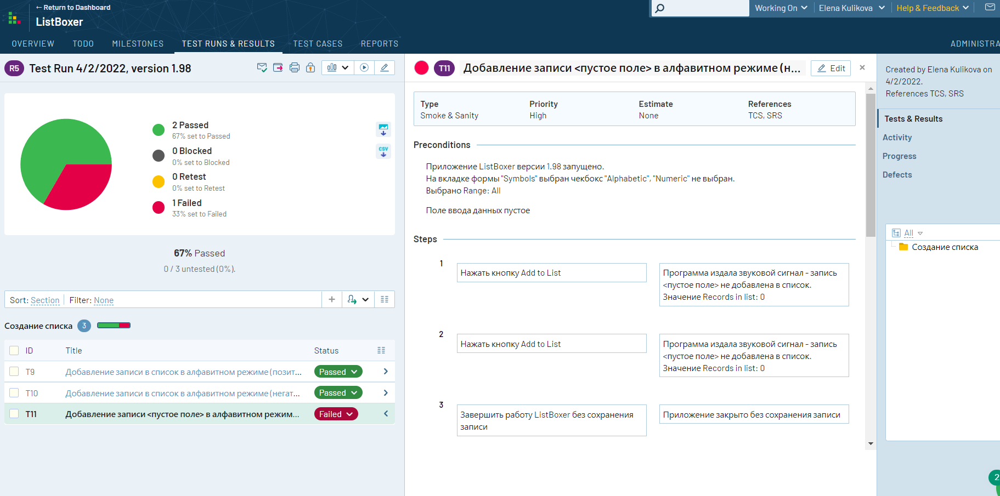
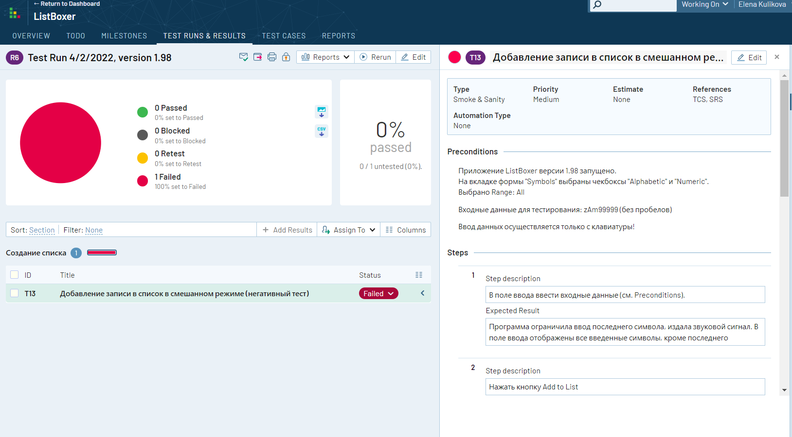

## Тестирование программы ListBoxer версии 1.98
* Программу ListBoxer версии 1.98 можно скачать [по ссылке](15376_ListBoxer.rar)

В данном репозитории представлены результаты ручного тестирования
1. Проведено тестирование требований [см. рецензии к файлу "Анализ требований..."](Requirments.pdf)
2. Составлен краткий тест-план [см. Тест-план](Test_plan.pdf)
3. Составлен чек-лист [см. Чек-лист](Check_list.pdf)
4. Составлено четыре тест-кейса для функциональности "Создание списка" [см. Тест-кейс 1 (passed)](TC1_positive.pdf), 
[Тест-кейс 2 (passed)](TC2_negative.pdf), [Тест-кейс 3 (failed)](TC3_negative.pdf), [Тест-кейс 4 (failed)](TC4_negative.pdf)
5. Результаты тестирования добавлены в TestRail , 
6. Баг-репорты добавлены в Jira [см. Bug report 1](Bugreport1.pdf), [Bug report 2](Bugreport2.pdf)

