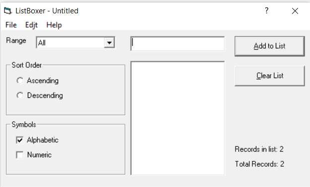

## Тестирование программы ListBoxer версии 1.98
<i> Программу ListBoxer версии 1.98 можно скачать [по ссылке](15376_ListBoxer.rar) </i>

В данном репозитории представлены результаты ручного тестирования
- Проведено тестирование требований [см. рецензии к файлу "Анализ требований..."](Requirements.pdf)
- Составлен краткий тест-план [см. Тест-план](Test_plan.pdf)
- Составлен чек-лист [см. Чек-лист](Check_list.pdf)
- Составлено четыре тест-кейса для функциональности "Создание списка" [см. Тест-кейс 1 (passed)](TC1_positive.pdf), 
[Тест-кейс 2 (passed)](TC2_negative.pdf), [Тест-кейс 3 (failed)](TC3_negative.pdf), [Тест-кейс 4 (failed)](TC4_negative.pdf)
- Заведено два баг-репорта в Jira [см. Bug report 1](Bugreport1.pdf), [Bug report 2](Bugreport2.pdf)
- Результаты тестирования добавлены в TestRail
### Test Run 4/3/2022 version 1.98

### Баги в ListBoxer

